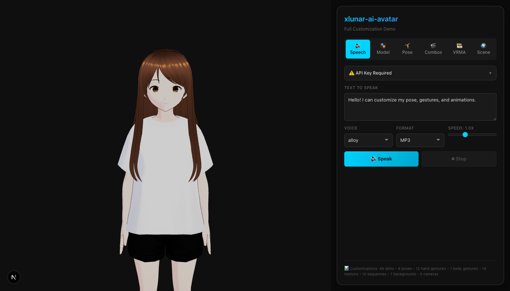
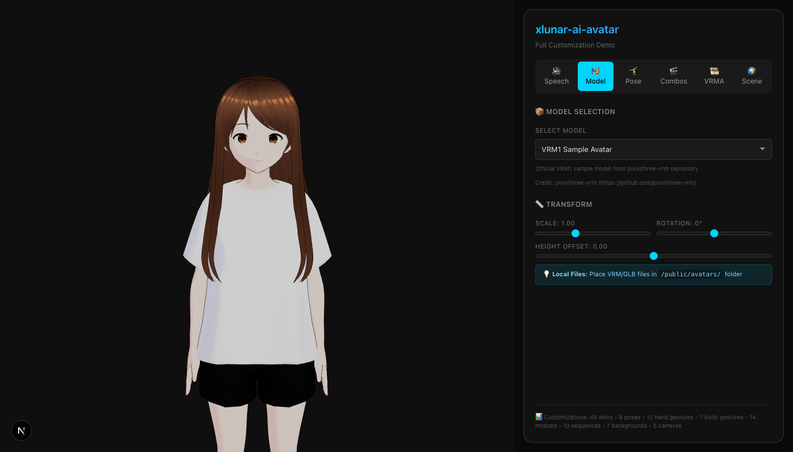
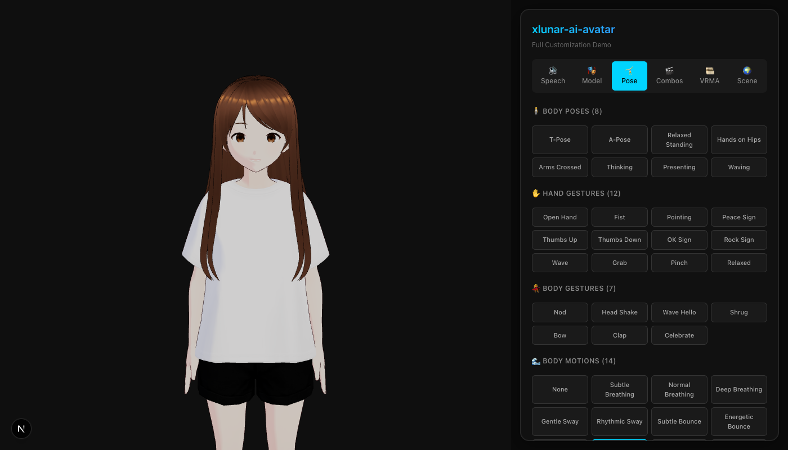
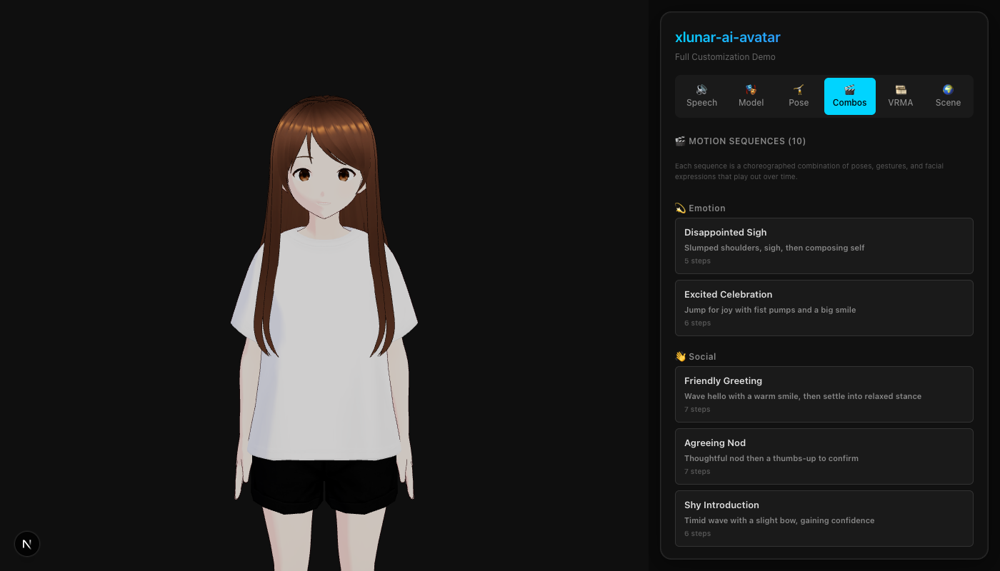
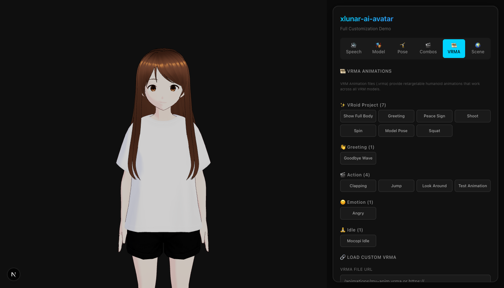
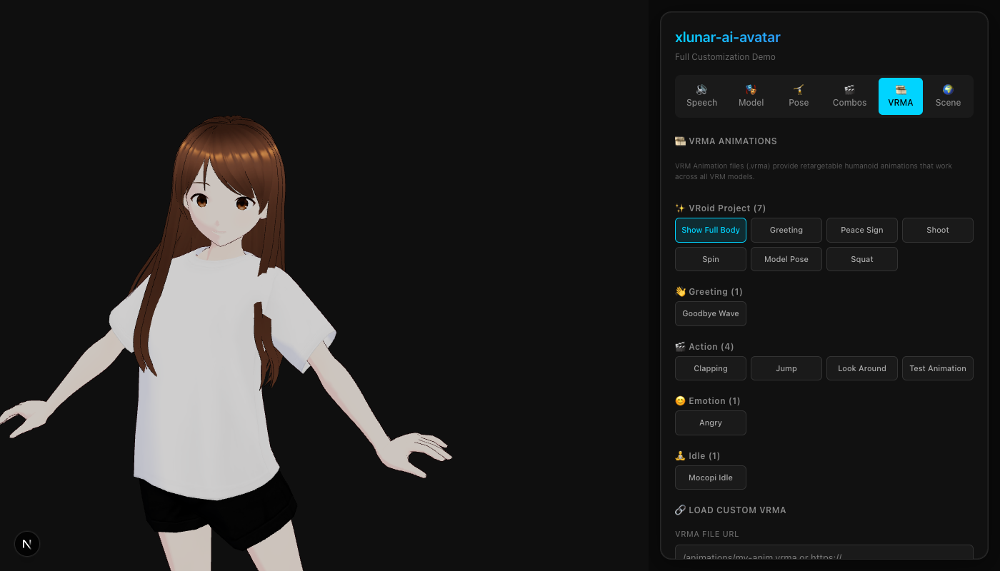
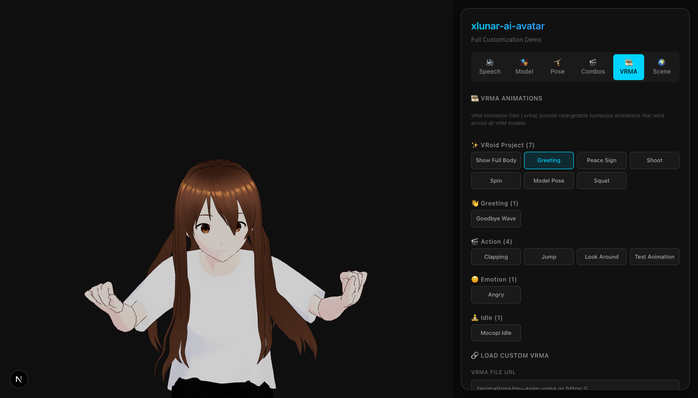
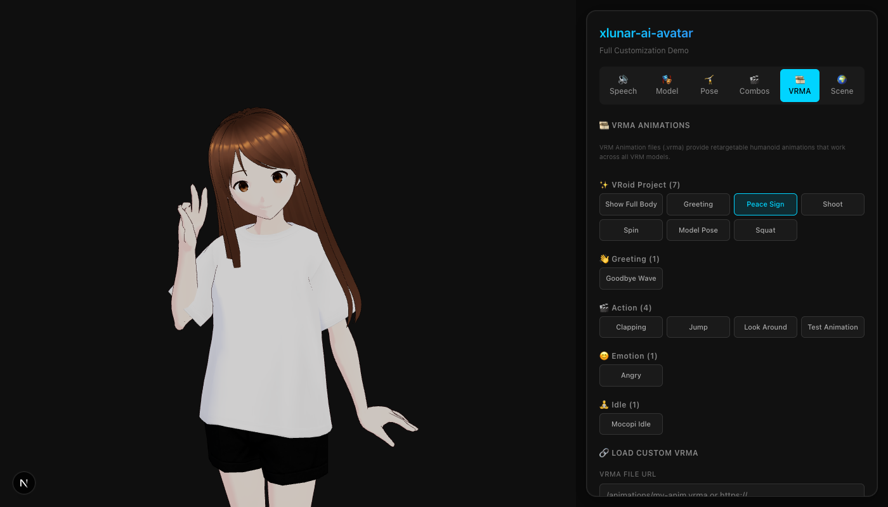
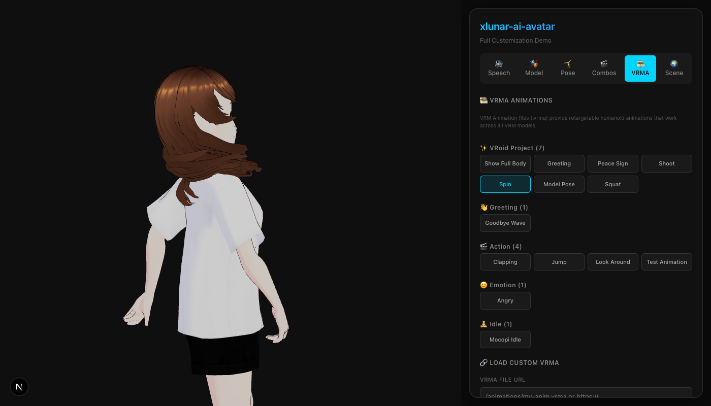
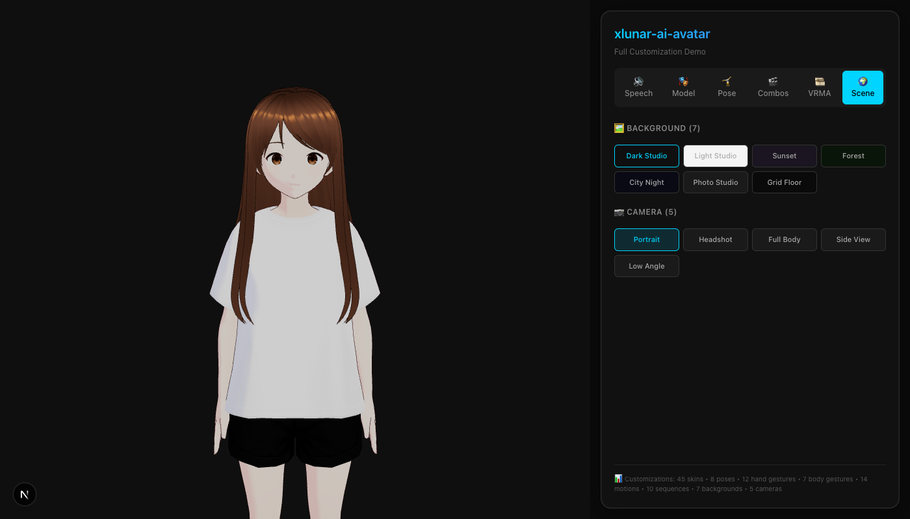

# xlunar-ai-avatar

An MVP-quality, open-source avatar "speech renderer" platform built with Next.js, React Three Fiber, and VRM.

[](https://opensource.org/licenses/MIT)


## Live Demo

**https://xlunar-ai-avatar.vercel.app/**

---

## Screenshots

### Main Interface

Clean split-panel design with 3D avatar viewport (left) and floating control panel (right).



### Model Selection (45 Models)

Choose from 34 VRoid Hub characters, VRM samples, and custom models.


### VRoid Hub Models

| Hinase | Yukina | Rii |
|--------|--------|-----|
|  |  |  |

| Uina | Ruika | Yue |
|------|-------|-----|
|  |  |  |

### Poses & Gestures

8 body poses, 12 hand gestures, 7 body gestures, 14 body motions.



### Motion Sequences

10 choreographed sequences across 5 categories: Emotion, Social, Thinking, Reaction, Presentation.



### VRMA Animations (14 Presets)

VRoid Project Motion Pack + community animations - retargetable to any VRM model.



#### VRMA Animation Examples

| Show Full Body | Greeting |
|----------------|----------|
|  |  |

| Peace Sign | Spin |
|------------|------|
|  |  |

### Scene Customization

7 backgrounds, 5 camera presets.



### Facial Expressions

25 expression presets: 10 emotions, 6 mouth shapes, 9 eye controls. Real-time blend shape control with smooth transitions.

| Category | Presets |
|----------|---------|
| **Emotions** | Neutral, Happy, Very Happy, Sad, Angry, Surprised, Relaxed, Thinking, Shy, Determined |
| **Mouth** | Closed, Aa, Ih, Ou, Ee, Oh |
| **Eyes** | Open, Closed, Half, Wink Left, Wink Right, Look Up/Down/Left/Right |

---

## Features

| Feature | Description |
|---------|-------------|
| **45 Avatar Models** | 34 VRoid Hub characters + VRM samples + custom URL support |
| **14 VRMA Animations** | 7 from VRoid Project + 5 from vrm-viewer + 2 others |
| **25 Facial Expressions** | 10 emotions + 6 mouth shapes + 9 eye controls |
| **Full Pose Control** | 8 poses, 12 hand gestures, 7 body gestures, 14 motions |
| **10 Motion Sequences** | Choreographed multi-step animations |
| **TTS Integration** | OpenAI gpt-4o-mini-tts with 10 voices |
| **Lip Sync** | Real-time mouth animation from audio amplitude |
| **Scene Control** | 7 backgrounds, 5 camera presets |
| **VRM Universal** | Supports VRM 0.x, 1.0, and VRoid GLB formats |
| **Library Mode** | Use as embeddable component in your own apps |

---

## Quick Start

```bash
# Install dependencies
npm install

# Configure environment
cp .env.example .env.local
# Add your OPENAI_API_KEY to .env.local

# Run development server
npm run dev
```

Open [http://localhost:3000](http://localhost:3000)

---

## Integration

This library can be embedded into your own Next.js/React applications.

### Installation (Copy Method)

```bash
# Copy the avatar library to your project
cp -r src/lib/avatar your-project/src/lib/

# Install required dependencies
npm install @pixiv/three-vrm @pixiv/three-vrm-animation @react-three/fiber @react-three/drei three
```

### Basic Usage

```tsx
import { AvatarStage, AvatarSpeechScene } from "@/lib/avatar";

function MyApp() {
  const audioRef = useRef<HTMLAudioElement>(null);
  
  return (
    <>
      <AvatarStage>
        <AvatarSpeechScene
          appearance={{ modelUrl: "/models/avatar.vrm" }}
          audioRef={audioRef}
        />
      </AvatarStage>
      <audio ref={audioRef} />
    </>
  );
}
```

### With Facial Expressions

```tsx
import { AvatarSpeechScene, EMOTION_PRESETS, getExpressionById } from "@/lib/avatar";

// Apply a preset expression
<AvatarSpeechScene
  appearance={{ modelUrl: "/models/avatar.vrm" }}
  audioRef={audioRef}
  expression={getExpressionById("happy")}
/>
```

### With VRMA Animation

```tsx
<AvatarSpeechScene
  appearance={{ modelUrl: "/models/avatar.vrm" }}
  audioRef={audioRef}
  vrmaUrl="/animations/Greeting.vrma"
  vrmaLoop={false}
/>
```

### With Poses

```tsx
import { getPoseById, getHandGestureById } from "@/lib/avatar";

<AvatarSpeechScene
  appearance={{ modelUrl: "/models/avatar.vrm" }}
  audioRef={audioRef}
  pose={getPoseById("relaxed")}
  handGesture={getHandGestureById("peace-sign")}
/>
```

### With TTS

```tsx
import { synthesizeToObjectUrl } from "@/lib/tts/client";

const speak = async (text: string) => {
  const url = await synthesizeToObjectUrl({ text, voice: "alloy" });
  audioRef.current.src = url;
  await audioRef.current.play();
};
```

**Full documentation:** [INTEGRATION.md](./INTEGRATION.md)

---

## Available Models

### VRoid Hub Collection (34 models)

All models from [VRoid Hub](https://hub.vroid.com/en/users/98739617):

| | | | |
|-------|-------|-------|-------|
| Hinase | Yukina | Rii (Uniform) | Rii |
| Uina | Ruika | Yukana | Yue |
| Moyu | Noan | Yuduki | Hagumi |
| Rise | Kirina | Konon | Meimi |
| Rizu | Hinari | Kanade | Saori |
| Aisa | Yukako | Memi | Nona |
| Eru | Momoa | Ayasa | Kanami |
| Yuyu | Miyuka | Rena | Irori |
| Kizuna | Yumeka | | |

### Sample Models

| Model | Format | License |
|-------|--------|---------|
| VRM1 Sample Avatar | VRM 1.0 | MIT (pixiv/three-vrm) |
| Seed-san | VRM 1.0 | CC0 (VRM Consortium) |
| Avatar Orion | VRM | CC0 (madjin/vrm-samples) |
| Cryptovoxels | VRM | CC0 (madjin/vrm-samples) |
| VRoid Samples A-D | GLB | CC0 (VRoid Studio) |

---

## VRMA Animations

### VRoid Project Motion Pack (7)

From [BOOTH](https://booth.pm/ja/items/5512385) by pixiv Inc. - **Free, requires credit**

| Animation | Description |
|-----------|-------------|
| Show Full Body | Full body presentation |
| Greeting | Greeting bow |
| Peace Sign | V-sign pose |
| Shoot | Shooting gesture |
| Spin | Spinning around |
| Model Pose | Fashion model pose |
| Squat | Squat exercise |

**Credit:** "Character animation credits to pixiv Inc.'s VRoid Project"

### Community Animations (7)

| Animation | Source | License |
|-----------|--------|---------|
| Goodbye Wave | vrm-viewer | MIT |
| Angry | vrm-viewer | MIT |
| Clapping | vrm-viewer | MIT |
| Jump | vrm-viewer | MIT |
| Look Around | vrm-viewer | MIT |
| Mocopi Idle | vrma-loader-sample | MIT |
| Test Animation | pixiv/three-vrm | MIT |

### Where to Find VRMA Animations

| Source | URL | Notes |
|--------|-----|-------|
| **VRoid Project (BOOTH)** | [booth.pm/ja/items/5512385](https://booth.pm/ja/items/5512385) | Free motion pack by pixiv Inc. (credit required) |
| **BOOTH Marketplace** | [booth.pm](https://booth.pm/ja/search/VRMA) | Search "VRMA" — many free and paid animations |
| **Mixamo** | [mixamo.com](https://www.mixamo.com/) | Free mocap library (FBX → convert to VRMA with [vrm-addon-for-blender](https://github.com/saturday06/VRM-Addon-for-Blender)) |
| **vrm-viewer** | [github.com/tk256ailab/vrm-viewer](https://github.com/tk256ailab/vrm-viewer) | MIT-licensed VRMA samples |
| **VRM Animation Test** | [github.com/pixiv/three-vrm](https://github.com/pixiv/three-vrm) | Sample VRMA from three-vrm repo |
| **Animated VRM** | [github.com/vrm-c/vrm-specification](https://github.com/vrm-c/vrm-specification) | VRM Consortium sample animations |
| **Rokoko** | [rokoko.com](https://www.rokoko.com/) | Motion capture → export FBX → convert to VRMA |
| **ActorCore by Reallusion** | [actorcore.reallusion.com](https://actorcore.reallusion.com/) | Free motion packs (FBX → convert) |

### Adding Custom VRMA

1. Place `.vrma` file in `public/animations/`
2. Add entry to `src/lib/avatar/config/animations.ts`
3. Animation appears in VRMA tab automatically

---

## Customization Summary

| Category | Count |
|----------|-------|
| Avatar Models | 45 |
| VRMA Animations | 14 (+custom) |
| Facial Expressions | 25 (10 emotions + 6 mouth + 9 eyes) |
| Body Poses | 8 |
| Hand Gestures | 12 |
| Body Gestures | 7 |
| Body Motions | 14 |
| Motion Sequences | 10 |
| Backgrounds | 7 |
| Camera Presets | 5 |
| TTS Voices | 10 |

---

## Architecture

```
src/lib/avatar/
├── index.ts                # Main entry point - all exports
├── animation/
│   ├── easing.ts           # 20+ easing functions
│   ├── VrmaPlayer.ts       # VRMA animation system
│   ├── PoseController.ts   # Pose/gesture control
│   ├── ExpressionController.ts # Facial expression system
│   ├── MotionSequence.ts   # Choreographed sequences
│   └── AnimationLayer.ts   # Mouth sync, idle animations
├── components/
│   ├── AvatarStage.tsx     # 3D canvas container
│   ├── AvatarRenderer.tsx  # Core VRM renderer
│   └── AvatarSpeechScene.tsx # Speech-enabled avatar
├── config/
│   ├── skins.ts            # 45 model presets
│   ├── poses.ts            # Poses, gestures, motions
│   ├── animations.ts       # VRMA animation presets
│   ├── expressions.ts      # 25 facial expressions
│   └── sequences.ts        # Motion sequences
├── loaders/
│   ├── Vrm0Handler.ts      # VRM 0.x support
│   ├── Vrm1Handler.ts      # VRM 1.0 support
│   └── VroidGlbHandler.ts  # VRoid GLB support
├── hooks/                  # React hooks
└── types/                  # TypeScript definitions
```

---

## Environment Variables

| Variable | Description | Default |
|----------|-------------|---------|
| `OPENAI_API_KEY` | OpenAI API key | Required |
| `OPENAI_TTS_MODEL` | TTS model | `gpt-4o-mini-tts` |
| `OPENAI_TTS_VOICE` | Default voice | `alloy` |

**Available voices:** alloy, ash, ballad, coral, echo, fable, nova, onyx, sage, shimmer

---

## License

MIT License - Copyright (c) 2024 [VaultX.technology](https://vaultx.technology)

### Credits

**Models:**
- VRoid Hub Collection (34): キャラクター紹介サイト管理人 via [VRoid Hub](https://hub.vroid.com/en/users/98739617)
- VRM Samples: pixiv/three-vrm (MIT), VRM Consortium (CC0), madjin/vrm-samples (CC0)
- VRoid Beta Samples: VRoid Studio by pixiv (CC0)

**Animations:**
- VRoid Project Motion Pack (7): pixiv Inc.'s VRoid Project - [BOOTH](https://booth.pm/ja/items/5512385)
- vrm-viewer (5): tk256ailab/vrm-viewer (MIT)
- sample-mocopi: tfuru/vrma-loader-sample (MIT)
- test.vrma: pixiv/three-vrm (MIT)
